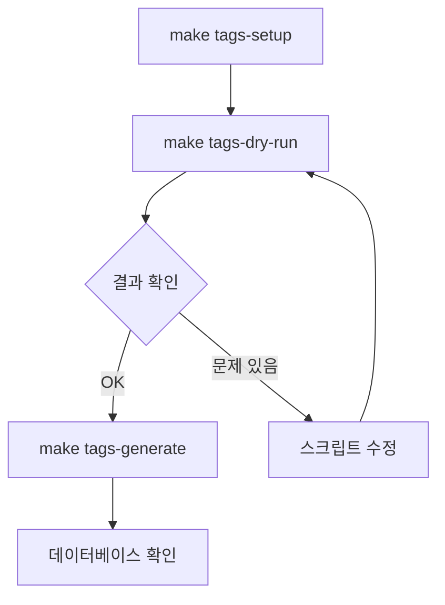

# Food Tag Generation Script

이 스크립트는 데이터베이스의 음식(foods) 데이터를 **배치 단위로** 조회하고, Clova Studio LLM을 사용하여 태그를 생성한 후, 데이터베이스에 저장합니다.

**주요 특징**:
- ⚡ **10배 빠른 성능**: 음식 100개를 15-20초에 처리 (단일 처리 대비)
- 🔄 **스마트 재시도**: 실패한 음식만 자동으로 재처리
- 🛡️ **강력한 에러 핸들링**: 자동 재시도, 배치 격리, 실패 로그 저장
- 💾 **배치 트랜잭션**: 한 배치 실패해도 다른 배치는 정상 처리

## 📋 목차

- [필수 조건](#필수-조건)
- [빠른 시작](#빠른-시작)
- [사용 방법](#사용-방법)
- [환경 변수](#환경-변수)
- [태그 카테고리](#태그-카테고리)
- [문제 해결](#문제-해결)

## 🔧 필수 조건

### 1. Docker 컨테이너 실행

PostgreSQL 데이터베이스가 실행 중이어야 합니다:

```bash
docker-compose up -d
```

### 2. 데이터베이스에 음식 데이터 존재

`foods` 테이블에 처리할 음식 데이터가 있어야 합니다.

### 3. Clova Studio API 키

`.env` 파일에 Clova Studio API 키를 설정:

```bash
CLOVA_API_KEY=your-api-key-here
```

## 🚀 빠른 시작

### 1. Python 환경 설정

```bash
make tags-setup
```

이 명령은:
- Python 가상 환경 생성 (`scripts/.venv`)
- 필요한 의존성 설치 (`psycopg2-binary`, `requests`)

### 2. Dry Run (테스트)

실제 데이터베이스에 변경을 가하지 않고 테스트:

```bash
make tags-dry-run
```

- 최대 5개의 음식에 대해 테스트
- LLM API 호출 및 태그 생성 확인
- 데이터베이스에는 저장하지 않음

### 3. 실제 태그 생성

```bash
# 모든 음식에 대해 태그 생성 (벌크 모드)
make tags-generate

# 또는 특정 개수만 처리
make tags-generate LIMIT=100

# 배치 크기 조정 (기본: 10)
make tags-generate BATCH_SIZE=5
```

## 📖 사용 방법

### Makefile 명령어

| 명령어 | 설명 |
|--------|------|
| `make tags-setup` | Python 환경 설정 및 의존성 설치 |
| `make tags-dry-run` | Dry run 모드로 테스트 (10개 음식) |
| `make tags-generate` | **모든 음식에 대해 태그 생성 (벌크 모드, 권장)** |
| `make tags-generate LIMIT=N` | N개의 음식만 처리 |
| `make tags-generate BATCH_SIZE=N` | 배치 크기 조정 (기본: 10) |
| `make tags-retry` | **스마트 재시도** - 이미 처리된 음식 건너뛰기 |
| `make tags-retry-safe` | **안전한 재시도** - 실패한 음식 ID를 JSON 파일로 저장 |
| `make tags-clean` | Python 가상 환경 삭제 |

### Python 스크립트 직접 실행

가상 환경을 활성화한 후 직접 실행:

```bash
# 가상 환경 활성화
source scripts/.venv/bin/activate

# 도움말 확인
python scripts/generate_food_tags_bulk.py --help

# Dry run 모드
python scripts/generate_food_tags_bulk.py --dry-run --limit 10 --batch-size 5

# 실제 실행 (배치 크기 10)
python scripts/generate_food_tags_bulk.py --batch-size 10

# 100개만 처리
python scripts/generate_food_tags_bulk.py --limit 100 --batch-size 10

# 스마트 재시도 + 실패 로그 저장
python scripts/generate_food_tags_bulk.py --skip-processed --save-failed failed.json
```

### 명령행 옵션

**기본 옵션**:
```
--dry-run           데이터베이스에 저장하지 않고 테스트만 수행
--limit N           처리할 음식 개수 제한
--batch-size N      벌크 모드: 한 번의 API 호출에 포함할 음식 개수 (기본: 10)
--delay SECONDS     API 호출 간 대기 시간 (기본: 1.0초)
```

**재시도 옵션**:
```
--skip-processed    이미 태그가 있는 음식 건너뛰기 (스마트 재시도)
--save-failed PATH  실패한 음식 ID를 JSON 파일로 저장
```

**사용 예시**:
```bash
# 스마트 재시도 + 실패 로그 저장
python scripts/generate_food_tags_bulk.py --skip-processed --save-failed failed.json

# 배치 크기 5로 재시도
python scripts/generate_food_tags_bulk.py --skip-processed --batch-size 5
```

## 🌐 환경 변수

### 데이터베이스 설정

| 변수 | 기본값 | 설명 |
|------|--------|------|
| `DB_HOST` | `localhost` | PostgreSQL 호스트 |
| `DB_PORT` | `5432` | PostgreSQL 포트 |
| `DB_NAME` | `dpm` | 데이터베이스 이름 |
| `DB_USERNAME` | `admin` | 데이터베이스 사용자 |
| `DB_PASSWORD` | `dpm` | 데이터베이스 비밀번호 |

### Clova Studio 설정

| 변수 | 기본값 | 설명 |
|------|--------|------|
| `CLOVA_API_KEY` | *(필수)* | Clova Studio API 키 |

### .env 파일 예시

```bash
# Database
DB_HOST=localhost
DB_PORT=5432
DB_NAME=dpm
DB_USERNAME=admin
DB_PASSWORD=dpm

# Clova Studio
CLOVA_API_KEY=nv-your-actual-api-key-here
```

## 🏷️ 태그 카테고리

스크립트는 다음 카테고리의 태그를 생성합니다:

### FLAVOR (맛 특성)
- `SPICY` - 매운맛
- `SWEET` - 단맛
- `SALTY` - 짠맛
- `SOUR` - 신맛
- `BITTER` - 쓴맛
- `UMAMI` - 감칠맛
- `SAVORY` - 고소한맛

### COOKING_METHOD (조리 방법)
- `FRIED` - 튀김
- `GRILLED` - 구이
- `BOILED` - 삶기
- `STEAMED` - 찜
- `RAW` - 날것
- `BAKED` - 베이킹

### INGREDIENT (주요 재료)
- `MEAT` - 육류
- `SEAFOOD` - 해산물
- `VEGETABLE` - 채소
- `DAIRY` - 유제품
- `GRAIN` - 곡물
- `FRUIT` - 과일

### NUTRIENT (영양 특성)
- `HIGH_PROTEIN` - 고단백
- `HIGH_CARB` - 고탄수화물
- `HIGH_FAT` - 고지방
- `LOW_CALORIE` - 저칼로리
- `HIGH_FIBER` - 고섬유질

### DIETARY (식이 제한)
- `VEGETARIAN` - 채식주의
- `VEGAN` - 비건
- `GLUTEN_FREE` - 글루텐 프리
- `LACTOSE_FREE` - 유당 불내증
- `HALAL` - 할랄

### ALLERGEN (알레르기 유발 물질)
- `DAIRY` - 유제품
- `GLUTEN` - 글루텐
- `SHELLFISH` - 갑각류
- `NUTS` - 견과류
- `EGGS` - 계란
- `SOY` - 콩

## 📊 출력 예시

```
🚀 Food Tag Generation Script
============================================================
Database: localhost:5432/dpm
Dry Run: False
Limit: None
API Delay: 1.0s
============================================================

✅ Database connection established

📊 Found 25 food(s) to process


[1/25]
============================================================
🍽️  Processing: 크림 파스타 (ID: 1)
============================================================
🤖 Generating tags from LLM...
  ✅ Generated 6 tags
    - SWEET (FLAVOR) [confidence: 0.85]
    - SAVORY (FLAVOR) [confidence: 0.90]
    - DAIRY (INGREDIENT) [confidence: 0.95]
    - HIGH_CARB (NUTRIENT) [confidence: 0.80]
    - DAIRY (ALLERGEN) [confidence: 0.95]
    - GLUTEN (ALLERGEN) [confidence: 0.90]
💾 Inserting tags into database...
  ✅ Tag 'SWEET' (ID: 1) linked to food
  ✅ Tag 'SAVORY' (ID: 2) linked to food
  ✅ Tag 'DAIRY' (ID: 3) linked to food
  ✅ Tag 'HIGH_CARB' (ID: 4) linked to food
  ✅ Tag 'DAIRY' (ID: 3) linked to food
  ✅ Tag 'GLUTEN' (ID: 5) linked to food

...

============================================================
📊 Summary
============================================================
Total Foods Processed: 25
Tags Created/Linked: 150
Skipped: 0
Errors: 0
============================================================

✅ All changes committed to database

🔌 Database connection closed
```

## 🔄 재시도 전략

### 스마트 재시도 (권장)

일부 음식에 대해 태그 생성이 실패한 경우, **이미 처리된 음식을 건너뛰고** 실패한 음식만 재처리할 수 있습니다.

```bash
# 기본 스마트 재시도
make tags-retry

# 배치 크기 조정
make tags-retry BATCH_SIZE=5
```

**동작 방식**:
- 데이터베이스에서 `food_tag` 관계가 없는 음식만 조회
- 이미 태그가 있는 음식은 자동으로 제외
- API 비용 절감 및 처리 시간 단축

### 안전한 재시도 (실패 로그 저장)

실패한 음식들의 ID를 JSON 파일로 저장하여 나중에 추적할 수 있습니다.

```bash
# 실패한 음식 ID를 JSON 파일로 저장
make tags-retry-safe

# 저장 위치: scripts/failed_foods.json
```

**실패 로그 형식**:
```json
{
  "timestamp": "2025-01-21T10:30:00",
  "total_failed": 5,
  "failed_food_ids": [123, 456, 789],
  "error_summary": {
    "token_limit": 2,
    "api_error": 1,
    "parse_error": 2
  }
}
```

### 에러 유형별 처리

벌크 스크립트는 다음과 같은 에러를 자동으로 처리합니다:

1. **Token Limit Error (429)**
   - 자동으로 3회까지 재시도
   - 지수 백오프 전략 사용 (1초 → 2초 → 4초)
   - 배치 크기를 줄여서 재시도 권장

2. **API Error**
   - 네트워크 오류 또는 서버 오류
   - 3회까지 자동 재시도
   - 실패 시 해당 배치만 건너뛰고 다음 배치 진행

3. **Parse Error**
   - LLM 응답 파싱 실패
   - 즉시 실패 처리 (재시도 안 함)
   - `--save-failed`로 실패한 음식 ID 저장

4. **Database Error**
   - 데이터베이스 연결 또는 쿼리 오류
   - 해당 배치 롤백
   - 다음 배치는 정상 진행

### 재시도 워크플로우 예시

```bash
# 1. 초기 실행 (일부 실패)
make tags-generate LIMIT=100
# 출력: ⚠️ Partial success - 80/100 foods processed

# 2. 스마트 재시도 (실패한 20개만 처리)
make tags-retry
# 출력: 📊 Found 20 unprocessed foods

# 3. 여전히 실패하는 경우 로그 저장
make tags-retry-safe
# 출력: 💾 Saved 5 failed food IDs to: scripts/failed_foods.json

# 4. 배치 크기를 줄여서 재시도
make tags-retry BATCH_SIZE=5
```

## 🔍 문제 해결

### 1. 데이터베이스 연결 실패

```
❌ Failed to connect to database: connection refused
```

**해결 방법**:
- Docker 컨테이너가 실행 중인지 확인: `docker ps`
- 컨테이너 시작: `docker-compose up -d`
- `.env` 파일의 데이터베이스 설정 확인

### 2. API 키 오류

```
❌ API request failed: 401 Unauthorized
```

**해결 방법**:
- `.env` 파일에 `CLOVA_API_KEY` 설정 확인
- API 키가 유효한지 확인

### 3. 음식 데이터 없음

```
⚠️  No foods found in database
```

**해결 방법**:
- 데이터베이스에 음식 데이터 추가
- 애플리케이션을 통해 음식 등록

### 4. Python 의존성 오류

```
ModuleNotFoundError: No module named 'psycopg2'
```

**해결 방법**:
```bash
make tags-setup
```

### 5. 중복 관계 경고

```
⚠️  Relationship already exists: food_id=1, tag_id=2
```

**설명**: 이미 존재하는 food-tag 관계는 건너뜁니다. 정상 동작입니다.

## 🧹 환경 정리

Python 가상 환경 삭제:

```bash
make tags-clean
```

## 📝 재현성 보장

이 스크립트는 다음 방법으로 재현성을 보장합니다:

1. **고정된 Python 의존성**: `requirements.txt`에 버전 명시
2. **가상 환경 사용**: 팀원마다 독립적인 환경
3. **환경 변수 설정**: `.env` 파일로 일관된 설정
4. **Makefile 자동화**: 동일한 명령어로 동일한 결과
5. **LLM Temperature 고정**: 0.3으로 설정하여 일관된 결과
6. **중복 방지**: 이미 존재하는 태그/관계는 건너뜀

## 🔄 워크플로우



## 🤝 팀원 가이드

### 처음 사용하는 경우

```bash
# 1. 저장소 클론 및 이동
cd api-server

# 2. Docker 컨테이너 시작
docker-compose up -d

# 3. Python 환경 설정
make tags-setup

# 4. 테스트 (dry run)
make tags-dry-run

# 5. 실제 실행 (10개만)
make tags-generate LIMIT=10
```

### 이미 설정된 경우

```bash
# Docker 시작 확인
docker ps

# 태그 생성
make tags-generate
```

## 📚 추가 정보

- **스크립트 위치**: `scripts/generate_food_tags_bulk.py`
- **의존성**: `scripts/requirements.txt`
- **로그**: 콘솔 출력으로 실시간 확인
- **실패 로그**: `scripts/failed_foods.json` (재시도 시 생성)

## ⚠️ 주의사항

1. **API 사용량**:
   - 음식 개수 ÷ 배치 크기만큼 API 호출 발생
   - 예: 100개 음식, 배치 크기 10 → 10번 API 호출
   - 재시도 시 `--skip-processed` 사용으로 불필요한 API 호출 방지

2. **실행 시간**:
   - 음식 100개 기준 약 15-20초 (배치 크기 10)
   - 배치 크기를 늘리면 더 빠르지만 token limit 위험 증가

3. **중복 실행**:
   - 데이터베이스에 이미 생성된 태그는 `ON CONFLICT DO NOTHING`으로 건너뛰므로 안전
   - `--skip-processed` 사용 시 데이터베이스 쿼리 자체를 줄여 더욱 효율적

4. **트랜잭션**:
   - 배치 단위로 트랜잭션 관리
   - 한 배치 실패해도 다른 배치는 정상 처리
   - 에러 발생 시 해당 배치만 자동 롤백

5. **재시도 전략**:
   - Token limit 에러 시 배치 크기를 줄여서 재시도 (예: `BATCH_SIZE=5`)
   - 반복적으로 실패하는 음식은 `--save-failed`로 로그 저장
   - 실패 로그를 분석하여 문제 패턴 파악
